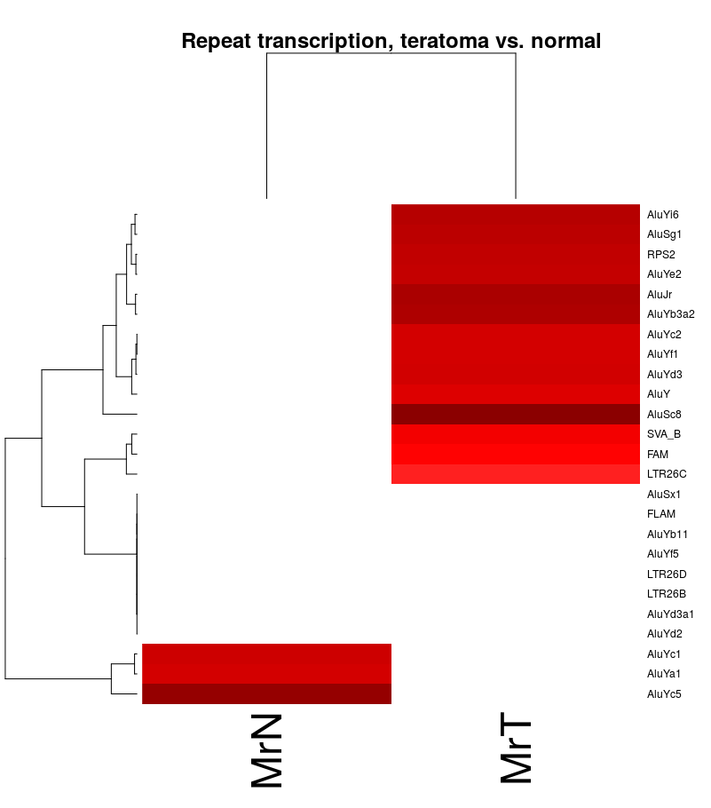

# artemis[](http://dx.doi.org/10.5281/zenodo.18242)[](https://travis-ci.org/RamsinghLab/artemis)  
RNAseq analysis, from raw reads to pathways, typically in a few minutes.  
(Mostly by wrapping [Kallisto](http://pachterlab.github.io/kallisto/) and caching everything we possibly can.)  
Also a sandbox for wacky new ideas about RNA methylation,  
functional analysis of differential transcript abundance,  
and various other sorts of related malarkey (run the demo!).  


```R
library(artemis)
## this assumes Kallisto is in ~/bin/
demo("example", package="artemis")
```

    
